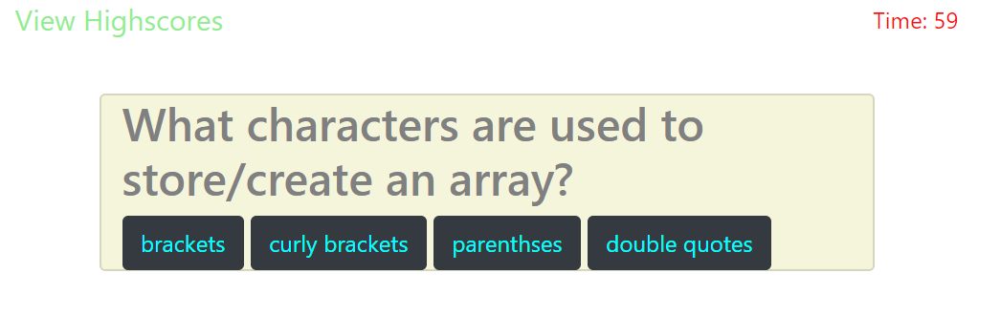
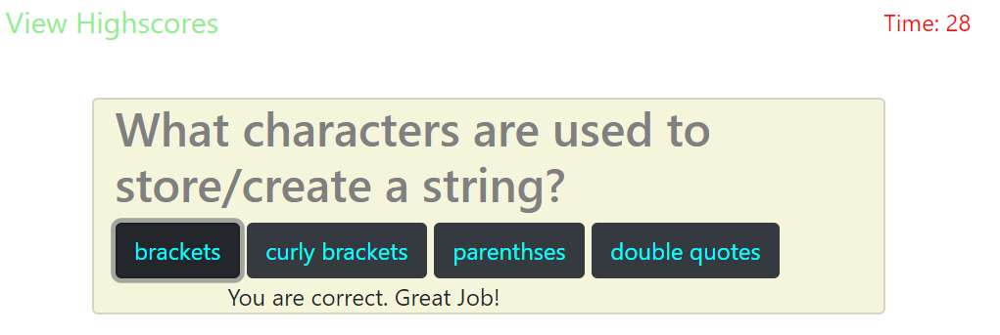
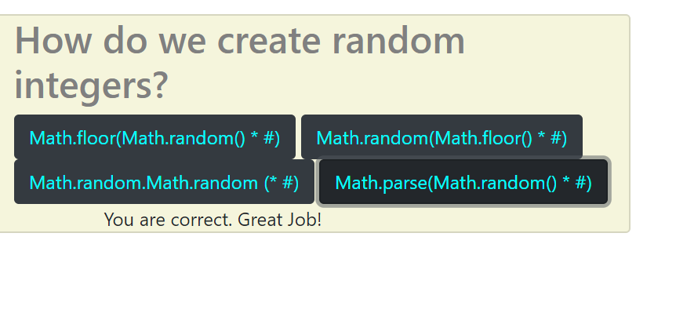
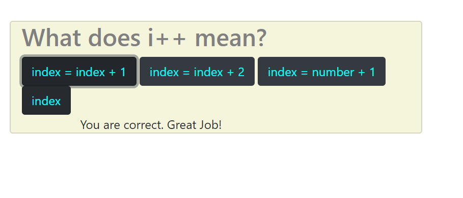
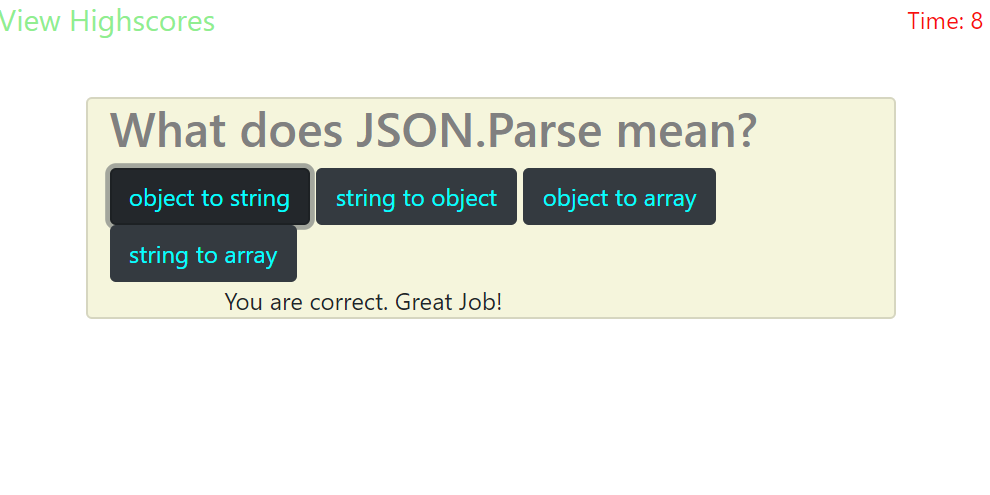

# HW4.codeQuiz

The object of this homework was to build a timed code with multiple-choice questions.  This app will run in the browser and feature dynamically updated HTML and CSS powered by the JavaScript code.  It will also feature clean and polished user interface and be responsive, ensuring it adapts to multiple screen sizes.

## The Accpetable Criteria
```
Given I am taking a code quiz
When I click the start button
Then a timer starts and I am presented with a question
When I answer a question
Then I am presented with another question
When I answer a question incorrectly
Then time is subtracted from the clock
When all questions are answered or the timer reaches 0
Then the game is over
When the game is over
Then I can save my initials and score
```

## What I achieved
https://tan-ali.github.io/HW4.codeQuiz/

```
Given I am taking a code quiz
When I click the start button
Then a timer starts and I am presented with a question
When I answer a question
Then I am presented with another question
When I answer a question incorrectly
Then time is subtracted from the clock
```

I was not able to complete
```
When all questions are answered or the timer reaches 0
Then the game is over
When the game is over
Then I can save my initials and score
```

I was able to have a timer start on the click of start on the front page.  I was also able to have all of my questions pop up after each was answered.  I was also able to subtract time from each wrong answer.

I had trouble getting the last page to pop up giving the user the option to put in their name and have it save to the local storage.

## Pictures of work













